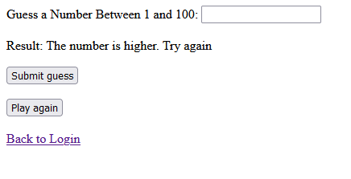

# Guessing Game

## Objective
To build a simple guessing game web application with PHP. To have login validation and store the user and game data in a database.

## Technologies
- PHP
- HTMl

## Design

- 
- 

## Execution
To build this application I used PHP to write the server side game logic, login validation, and database connected services. 

### Download
- [Guessing Game](https://github.com/Chase-CK/GuessingGame/archive/refs/heads/master.zip)
