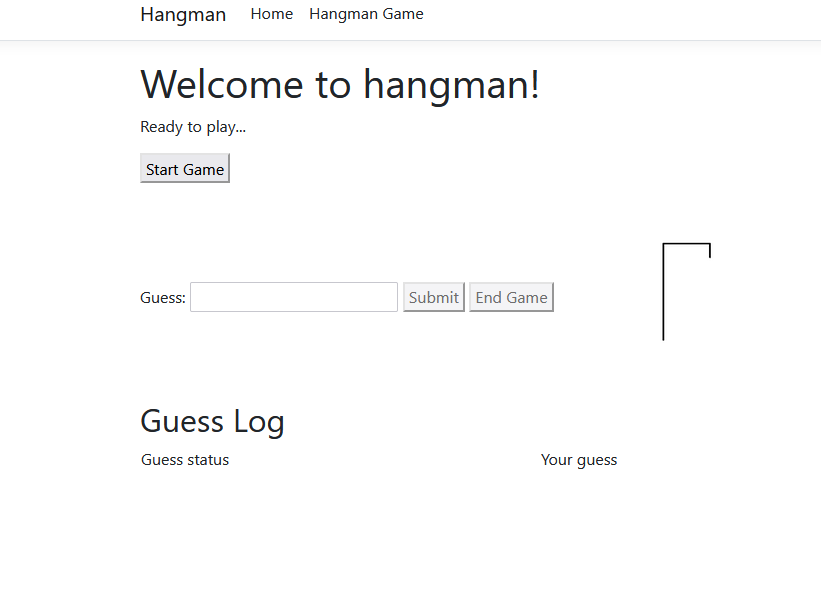
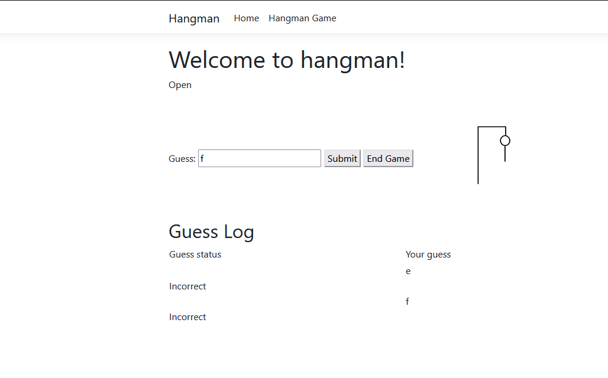
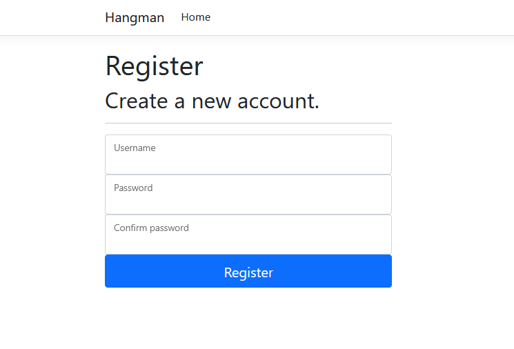

# Hangman Game


## Objective

To create an asynchronous hangman game with user login validation, and registration. To use a database to store user information and game score information. To have the game display an image of the parts of the hung man as guessed words are incorrect. To display whether their guess was either correct or incorrect.


## Technologies

- C#
- ASP.NET
- Javascript
- Websockets

## Design

### The Homescreen

- 
### The Game Page

- 
### The Game Page in the middle of play

- 
### The Login Page

- 


## Code snippets of my work

C# websocket controller code

```c#
public string Guess(string currWord, char[] b)
        {
            char c = b.FirstOrDefault();                      
            string message = "";
            
            // for each letter in currentWord add to list letters
            // if current word contains result/guess send correct or wrong message
            for (int i = 0; i < 1; i++)
            {
                if(counter == currWord.Length-1)
                {
                    saveScoreAsync(uId, counter, currWord);
                    message = "You Win!!!";
                    break;
                }
                if(loserCount == 5)
                {
                    saveScoreAsync(uId, counter, currWord);
                    message = "You Lost!!!";
                    break;
                }
                if (currWord.Contains(c))
                {                    
                    if (letters.Contains(c))
                    {
                        loserCount++;
                        message = "Used letter";
                        break;
                    }
                    letters.Add(c);
                    var x = HttpContext.Session.GetString("corGuess");
                    HttpContext.Session.SetString("corGuess", x + c);
                    for (int j = 0; j < currWord.Length; j++)
                    {
                        if(char.ToLower(currWord[j]) == char.ToLower(c))
                        {
                            counter++;
                        }                        
                    }                    
                    message = "Correct";
                    break;
                }
                loserCount++;
                message = "Incorrect";
                
            }
            return message;
        }       
        public async Task saveScoreAsync(int id, int score, string currW)
        {
            var newScore = new Scores
            {
                UserId = id,
                Score = score,
                WordPlayed = currW,
            };

            _context.Scores.Add(newScore);
            await _context.SaveChangesAsync();
        }
```
Javascript game code

```javascript
sendButton.onclick = function () {
        if (!socket || socket.readyState !== WebSocket.OPEN) {
            alert("socket not connected");
        }
        var data = sendMessage.value;
        let length = data.length;
        if(length > 1){
            alert("Please enter one character");
        }
        else{
            socket.send(data);
            commsLog.innerHTML += '<tr>' +
            '<td class="commslog-data"></td>' +
            '<td class="commslog-data">' + htmlEscape(data) + '</td></tr>';
        }
    };


 connectButton.onclick = function() {
        stateLabel.innerHTML = "Connecting";
        socket = new WebSocket(connectionUrl.value);
        socket.onopen = function (event) {
            updateState();
            commsLog.innerHTML += '<tr>' +
                '<td colspan="3" class="commslog-data"></td>' +
            '</tr>';
        };
        socket.onclose = function (event) {
            updateState();
            commsLog.innerHTML += '<tr>' +
                '<td colspan="3" class="commslog-data"> ' + htmlEscape(event.reason) + '</td>' +
            '</tr>';
        };

        let counter = 1;

        socket.onerror = updateState;
        socket.onmessage = function (event) {             
            commsLog.innerHTML += '<tr>' +      
                '<td class="commslog-data">' + htmlEscape(event.data) + '</td></tr>';
                  if(event.data == 'Incorrect' || event.data == 'Used letter' || event.data == 'You Lost!!!'){
                    counter++;
                    hangman.src = "hangman" + counter + ".png";
                  } else if (event.data == 'You Win!!!') {
                        alert("You win!")
                        closeButton.click();
                  } 
                  if(event.data == 'You Lost!!!'){
                        alert("You Lose!")
                        closeButton.click();
                  }                   
        };
    };


```

### Download
- [Hangman](https://github.com/seanafoster/Hangman/archive/refs/heads/master.zip)
