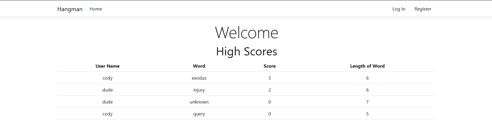

# Hangman Game

## Objective
To create an asynchronous hangman game with user login validation, and registration. To use a database to store user information and game score information. To have the game display an image of the parts of the hung man as guessed words are incorrect. To display whether their guess was either correct or incorrect.

## Technologies
- C#
- ASP.NET
- Javascript
- Websockets

## Design
### The Homescreen
- 
### The Game Page
- 
### The Game Page in the middle of play
- 
### The Login Page
- 
